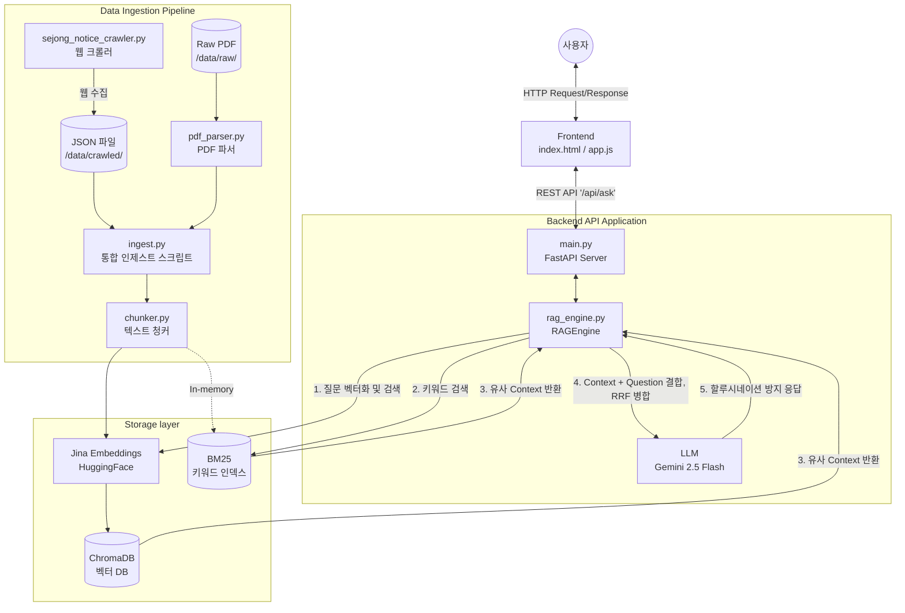

# SejongBrain 프로젝트 아키텍쳐 (Architecture Overview)

본 문서는 세종대학교 학사 정보 AI 질의응답 서비스인 **SejongBrain**의 전체 시스템 아키텍쳐를 설명합니다.

## 디렉토리 구조 및 역할

```text
/mnt/c/Users/user/project/rag
├── backend/                  # 백엔드 서버 및 RAG 비즈니스 로직
│   ├── main.py               # FastAPI 기반 웹 서버, API 라우팅 및 정적 파일 서빙
│   ├── models.py             # Pydantic 데이터 모델 (Request/Response)
│   └── rag_engine.py         # 하이브리드 RAG 검색 엔진, 체인 구성 (Langchain)
├── crawlers/                 # 데이터 수집 모듈 (웹, 로컬)
│   ├── pdf_parser.py         # 학교 학사편람 등 PDF 문서 파싱
│   └── sejong_notice_crawler.py # 세종대 학사공지사항 웹 크롤러 (JSON 저장)
├── processors/               # 데이터 처리 및 변환 모듈
│   └── chunker.py            # Langchain 텍스트 스플리터를 이용한 청킹 로직
├── frontend/                 # 사용자 UI (바닐라 JS + HTML/CSS)
│   ├── index.html            # 메인 페이지 구조
│   ├── app.js                # API 통신, 답변 생성, Markdown 렌더링
│   └── styles.css            # UI 스타일링
├── data/                     # 데이터 저장소 (로컬)
│   ├── raw/                  # 원본 PDF 파일들
│   ├── crawled/              # 크롤러가 수집한 JSON 데이터
│   ├── processed/            # 청킹된 데이터 백업(chunks.json)
│   └── chromadb/             # 임베딩 데이터가 영구 저장되는 벡터 DB 저장소
├── ingest.py                 # 통합 데이터 수집/인제스트 파이프라인 (CLI 실행)
├── rag_pipeline.py           # (구) RAG 파이프라인 레거시 스크립트
└── config.json               # 환경설정 파일 (Google API 키 등 API 연동 정보 보관)
```

## 핵심 시스템 플로우 (데이터 흐름)

SejongBrain은 크게 **1. 데이터 인제스트(Data Ingestion) 파이프라인**과 **2. 질의응답 서버(Q&A Server) 파이프라인**으로 구성됩니다.

### 1. 데이터 인제스트 파이프라인 (`ingest.py`)
PDF 및 크롤링된 데이터 소스를 읽어와 청크(Fragment)로 나눈 후 벡터 데이터베이스(ChromaDB)에 적재합니다.

- **Data Sources:** 
  - `crawlers/sejong_notice_crawler.py` : 학교 홈페이지 학사공지를 크롤링하여 `data/crawled` 내 JSON으로 저장 
  - `data/raw/*.pdf` : 학사편람 등 로컬 PDF 파일들
- **Parsing & Chunking:** `crawlers/pdf_parser.py` 및 `processors/chunker.py`를 활용해 문서를 로드하고, 의미 단위 청크 단위로 Split 수행
- **Embedding & Indexing:** `backend/rag_engine.py` 내의 `index_documents()` 메서드를 통해 `HuggingFaceEmbeddings` (jinaai/jina-embeddings-v5) 모델로 임베딩한 후 `ChromaDB`에 영구 저장

### 2. 질의응답 서버 파이프라인 (`backend/main.py`)
사용자의 질문을 받아 문맥 기반 하이브리드 검색을 수행하고, LLM을 통해 최종 답변을 생성하여 리턴합니다.

- **Frontend Interfaction:** 브라우저에서 사용자가 서버(`FastAPI`)에 REST API로 질문 전송
- **Hybrid Search (RAG Engine):** 
  - 사용자의 질문을 기반으로 ChromaDB 벡터 유사도 검색 및 BM25 키워드 검색 동시 수행
  - **Reciprocal Rank Fusion(RRF)** 알고리즘을 사용하여 두 검색 결과를 합산 및 재정렬
- **LLM Generation:** 랭체인(Langchain) Prompt Template을 통해 하이브리드 검색으로 도출된 최종 관련 문맥정보(Context)와 질문을 조합 후 Google `Gemini 2.5 Flash` 기반 프롬프트에 주입시켜 답변 도출 (할루시네이션 억제 프롬프트 적용)
- **Response:** FastAPI가 생성된 답변(Answer)과 참고한 소스 문서 리스트(Sources: 제목, 페이지 등)를 최종적으로 클라이언트(프론트엔드)에 반환

---

## 아키텍쳐 다이어그램 (Mermaid)


